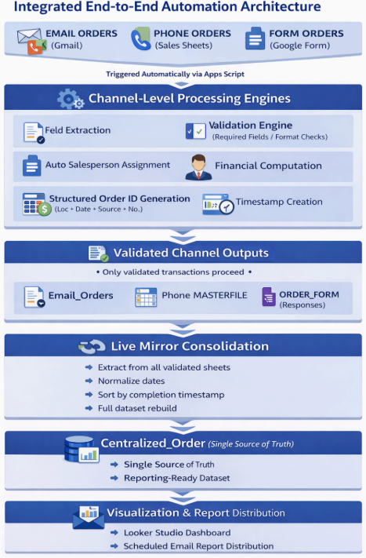

# Smart_Automation_Workflow_Excelerate_Internship_Project

# Sales Order Automation System

## Overview

The **Sales Order Automation System** is an end-to-end automation solution that processes sales orders from multiple channels—**Email, Phone, and Google Forms**—and transforms them into a **validated, centralized, and report-ready dataset**.

This system replaces manual data entry, validation, and reporting with a fully automated workflow powered by **Google Apps Script**, improving efficiency, accuracy, and scalability.

---

## Objectives

- Automate multi-channel order intake (Email, Phone, Forms)
- Eliminate manual data encoding and validation
- Ensure accurate financial computation and product matching
- Generate structured and traceable Order IDs
- Centralize all transactions into a single source of truth
- Enable real-time dashboard reporting and automated distribution

---

## System Architecture

The system follows a **multi-channel, trigger-based architecture**:

---

## 🔄 End-to-End Workflow

Customer Order → Trigger Activation → Data Extraction → Validation →
Financial Computation → Order ID Generation → Consolidation → Dashboard Reporting

### Architecture Components

- **Trigger Layer** (time-driven & event-driven)  
- **Processing Engine** (validation, computation, assignment)  
- **Live Mirror Consolidation**  
- **Reporting Layer (Looker Studio)**  

---

## Key Features

### Multi-Channel Order Processing
- Email Orders (Gmail parsing)
- Phone Orders (Google Sheets encoding)
- Form Orders (Google Forms submissions)

---

### Automated Validation Engine
- Required field validation
- Product matching from `PRODUCT_MASTER`
- Format validation (dates, phone numbers)
- Prevention of incomplete or invalid records

---

### Financial Computation
- Automatic calculation: **Quantity × Unit Price**
- Currency sanitization
- Error-free computations

---

### Structured Order ID Generation
- Format: `Location + Date + Source + Sequence`
- Prevents duplication and ensures traceability

---

### Automated Salesperson Assignment
- Territory-based mapping
- Consistent and error-free attribution

---

### Live Mirror Consolidation
- Merges all validated records
- Removes duplicates and deleted entries
- Maintains chronological order
- Acts as **single source of truth**

---

### Automated Reporting
- Real-time dashboard (Looker Studio)
- Scheduled report generation
- Automatic email distribution
